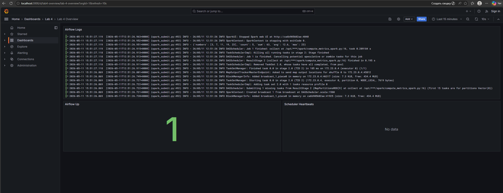

# Лабораторная работа 4

Четвертая лабораторная строится на базе `lab_3`: мы сохраняем стек `Airflow + Spark` и дополняем его observability-компонентами `Loki`, `Alloy`, `Prometheus` и `Grafana`.

## Что находится в директории

- `Dockerfile` — кастомный образ Airflow с Java и Spark-зависимостями.
- `docker-compose.yml` — конфигурация для `postgres`, `spark-master`, `spark-worker`, `airflow-init`, `airflow-webserver`, `airflow-scheduler`, `loki`, `alloy`, `prometheus`, `grafana`.
- `dags/compute_metrics_spark_dag.py` — DAG, отправляющий spark-job в Spark.
- `spark/compute_metrics_spark.py` — spark-job на `pyspark`.
- `alloy.config` — сбор Airflow-логов и отправка их в `Loki`.
- `prometheus.yml` — сбор метрик Airflow в `Prometheus` через `statsd-exporter`.
- `grafana/` — provisioning datasource и dashboard-файлов `Grafana`.
- `CHANGES.md` — список отличий от ЛР3.

## Скриншоты



## Локальная проверка файлов

Из корня репозитория:

```bash
python3 -m unittest lab_4/tests/test_lab4_observability.py -v
python3 -m py_compile lab_4/dags/compute_metrics_spark_dag.py lab_4/spark/compute_metrics_spark.py
```

## Как запустить сервисы локально

Перейти в директорию лабораторной:

```bash
cd lab_4
```

Поднять стек:

```bash
docker compose up -d
```

Проверить контейнеры:

```bash
docker compose ps
```

## Автоматическая настройка

- Connection `spark_local` создается автоматически через переменную окружения `AIRFLOW_CONN_SPARK_LOCAL`.
- Метрики Airflow отправляются в `statsd-exporter`, а `Prometheus` забирает их без ручной настройки.
- Datasource `Loki` и `Prometheus` в `Grafana` создаются автоматически через provisioning-файлы.
- Dashboard `Lab 4 Overview` в `Grafana` создается автоматически без ручного прокликивания.

## Веб-интерфейсы

- Airflow UI: `http://localhost:8080/`
- Spark UI: `http://localhost:4040/`
- Grafana: `http://localhost:3000/`
- Prometheus: `http://localhost:9090/`
- Loki API: `http://localhost:3100/`
